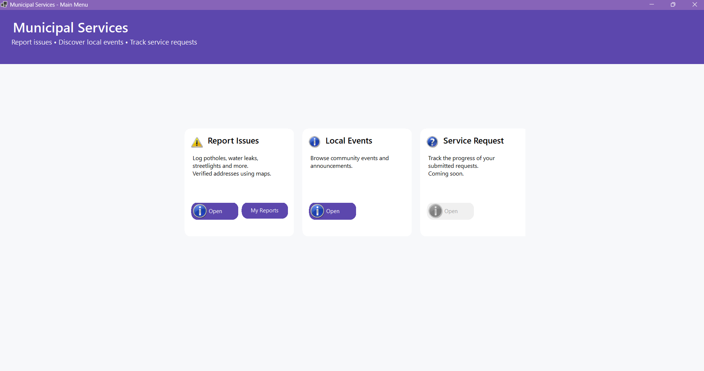
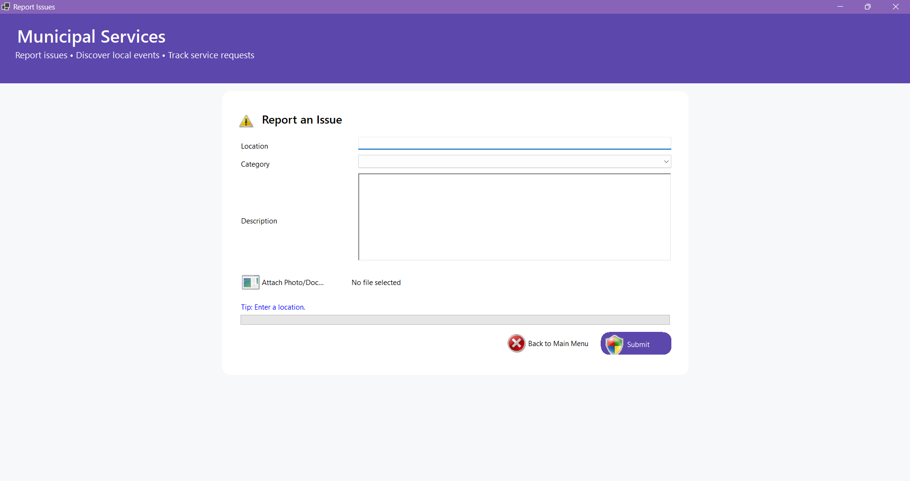
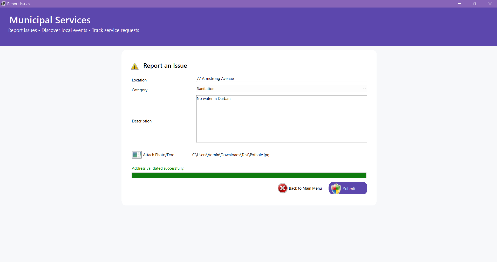
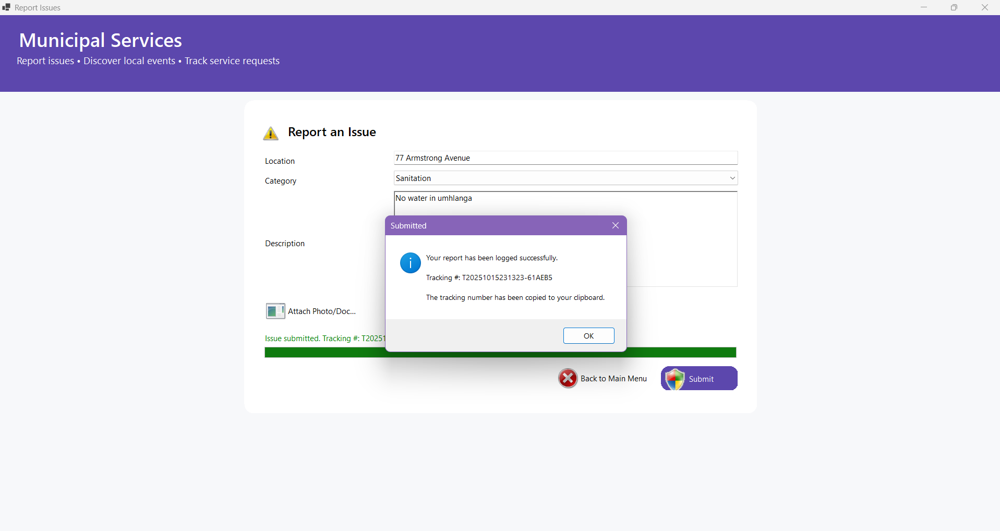
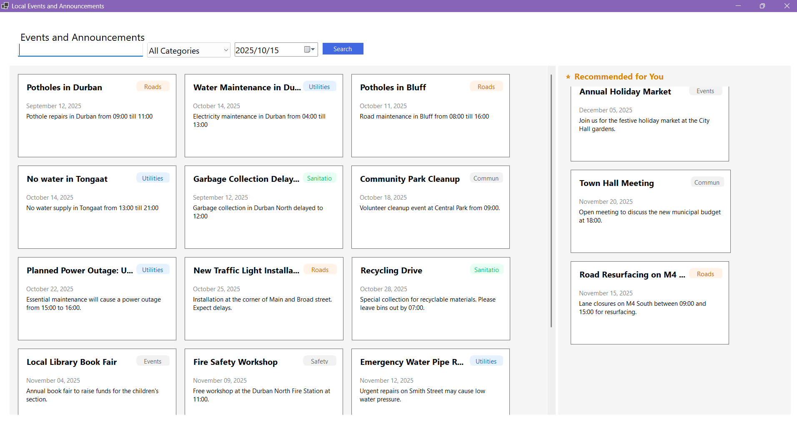
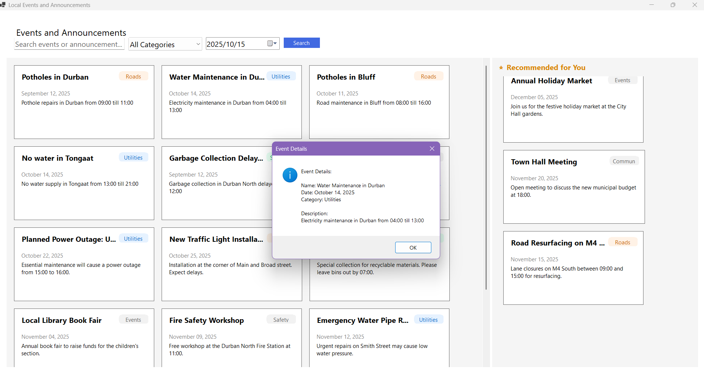
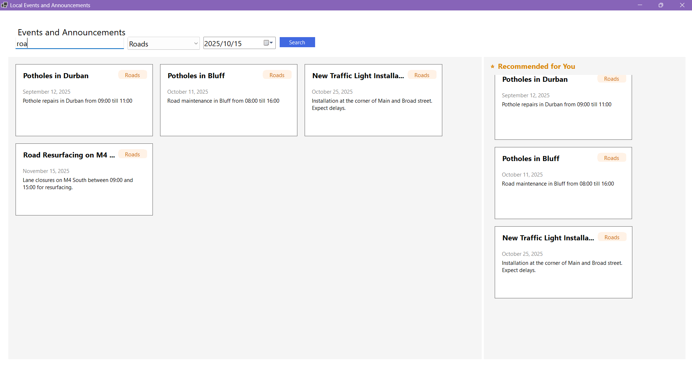
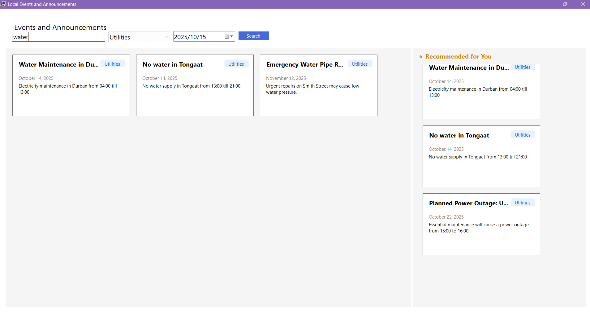

# MunicipalServiceApp

A simple, modern Windows Forms application for reporting municipal issues with validated addresses and live user-engagement feedback.

## ✨ Highlights

-   Windows Forms UI with a clean header and card-style navigation.
-   Report an Issue form with:
    -   Address validation & normalization via OpenStreetMap Nominatim.
    -   Live progress bar that increases as users complete required fields.
    -   Attachments support (photo/document).
    -   Tracking number shown in the popup and copied to clipboard after submission.
-   Custom data structures (no built-in generic collections) powering repositories and storage.
-   Layered architecture (Domain, Application, Infrastructure, Presentation) using interfaces and dependency injection in Program.cs.

## 🎥 Part 1 YouTube Demo

Here is a link to the Demo of the application done on YouTube: https://youtu.be/8cFkDTEG0O8.

Note: This video is set to unlisted so anyone with the link can view the demo.

## 🧠 Architecture Overview

-   **Domain** – Entities and core rules (Issue, Categories).
-   **Application** – Use-cases and contracts
    -   `IIssueService` validates and creates issues, generates tracking tokens, returns results.
    -   `IGeocodingService` validates/normalizes addresses and returns coordinates.
-   **Infrastructure**
    -   `InMemoryIssueRepository` uses custom data structures (`SinglyLinkedList`, `SimpleSet`) to store Issues.
    -   `NominatimGeocodingService` calls OpenStreetMap Nominatim (free) for address validation (with a proper User-Agent).
-   **Presentation** – Windows Forms UI (Main Menu + Report Issues).

Dependency flow: Presentation → Application → Infrastructure (Domain is shared).

## 🧰 Custom Data Structures

The app does not rely on built-in generic collections to store issues.

-   `Infrastructure/DataStructures/SinglyLinkedList<T>`
    -   Minimal linked list with Add, enumerator support, etc.
-   `Infrastructure/DataStructures/SimpleSet<T>`
    -   Simple, uniqueness-enforcing set.

`InMemoryIssueRepository` uses these to store and query Issue records.
`Categories.All()` exposes categories via a custom enumerator so the UI can populate the combo box without List<T>.

## 🗺️ Address Validation (Geocoding)

-   **Provider:** OpenStreetMap Nominatim (free).
-   **Service:** `NominatimGeocodingService` (implements `IGeocodingService`):
    -   Sends a single GET to Nominatim with your query.
    -   Normalizes address (display name) + returns latitude/longitude.
    -   Includes a User-Agent header, as required by Nominatim’s policy.
    -   Returns `GeoValidationResult` with Success, NormalizedAddress, Latitude, Longitude.
-   Requires an internet connection. If offline, the service returns a friendly error and the form will prevent submission.

## 🎯 User Engagement: Live Progress

The progress bar increases as users complete fields:

-   Location entered → +30%
-   Category selected → +20%
-   Description ≥ 10 chars → +30%
-   Attachment added → +20%

This provides immediate feedback (“Ready to submit” at 100%), and the bar animates to 100% during submission.

## ▶️ Getting Started

**Prerequisites**

-   Windows
-   .NET 6, 7, or 8 SDK (Visual Studio 2022 preferred)
    -   If you target .NET 6+, `ApplicationConfiguration.Initialize()` is available.
    -   For .NET Framework / earlier, use `Application.EnableVisualStyles()` etc.

**Run**

Clone

```sh
git clone https://github.com/ST10339549/ST10339549_PROG7312_POE_P1.git
```

```
cd ST10339549_PROG7312_POE_P1/MunicipalServiceApp
```
Open the solution in Visual Studio.

Set MunicipalServiceApp as the startup project.

Run (F5).

The composition root wires services in Program.cs:

```sh
var repo = new InMemoryIssueRepository();
var svc  = new IssueService(repo);
var geo  = new NominatimGeocodingService();

Application.Run(new Presentation.MainMenuForm(svc, geo));
```

### 🧪 Manual Test Checklist
Open App → Main Menu is visible.

Report Issues:

- Enter a valid Durban address (e.g., “Chartwell Dr, Umhlanga”).

- Progress should increase; geocoding should succeed.

- Choose a Category and type a Description (≥10 chars).

- Attach an image or PDF (optional for 100%).

- Click Submit → progress animates to 100% → tracking number is shown and copied to clipboard.

- Invalid Address: enter nonsense; you should get “Invalid Address” and a helpful message.

- Reset: form clears after success; progress returns to 0–20% depending on defaults.

## 🚀 Part 2: Local Events & Announcements

Part 2 builds upon the application's foundation by introducing the Local Events and Announcements module. This feature provides a dynamic, user-friendly dashboard for residents to discover, search, and sort municipal activities, moving beyond static forms into a more interactive experience.

### 🎥 Part 2 YouTube Demo
Here is a link to the Demo of the Part 2 features on YouTube: https://youtu.be/geU8WFWdjCk.

### ✨ Feature Overview & UI
The Events & Announcements screen provides a modern, responsive interface for browsing municipal notices.

Dynamic Card UI: Events are not shown in a simple list. Instead, each event is rendered as a distinct "card" in a responsive layout, similar to a modern web feed.

Search & Sort: Users can instantly filter the visible events by typing a category or date into a search bar. They can also sort the entire list by criteria like event name or date.

Recommendations: The application makes use of a recommendation algorithm which shows the three most recent events. While basic, it uses LINQ to efficiently query and sort the event data.

### 🧠 UI/UX Implementation
To achieve the modern, card-based feel within Windows Forms, the module avoids standard ListBox controls and instead uses a more advanced approach:

EventCard UserControl: A custom, reusable control was created to act as the template for a single event. It contains styled labels and panels to display the event's category, title, date, and description. Each card on the screen is an instance of this UserControl.

FlowLayoutPanel: The main form uses FlowLayoutPanel containers to dynamically arrange the EventCard controls. This allows the layout to be responsive and gracefully handle a variable number of events, automatically wrapping cards and adding scrollbars as needed.

### 🧰 Data Structures in Part 2
This part of the POE focuses on utilising a range of advanced data structures to manage the event data efficiently:

SortedDictionary<int, Event>: This is used as the primary in-memory storage for all events. It keeps the collection sorted by the event's unique Id (the key), allowing for extremely efficient lookups and ordered retrieval.

HashSet<string>: This structure holds the unique set of all event categories (e.g., "Roads", "Utilities"). It provides a high-performance (O(1) average time complexity) way to populate filter options and perform lookups.

Stack<Event>: A stack is used to implement a feature like a "Last Viewed" history, pushing each event the user interacts with onto the stack.

Dictionary<string, int>: This dictionary powers the recommendation engine. It stores search terms (categories) as keys and the number of times they've been searched as values, making it easy to find the user's most frequent interests.

### ▶️ How to Test Part 2
From the Main Menu, click the Local Events and Announcements button.

The form should load and display 15+ sample event cards.

Use the search box to filter by a category (e.g., "Roads" or "Community"). The list of cards should update in real-time.

As you perform different category searches, observe the "Recommended for You" section on the right updating with relevant suggestions.

## 🛣️ Roadmap for Part 3
Part 3: Service Request Status (search by tracking number; timeline of updates).

## 📸 Screenshots








